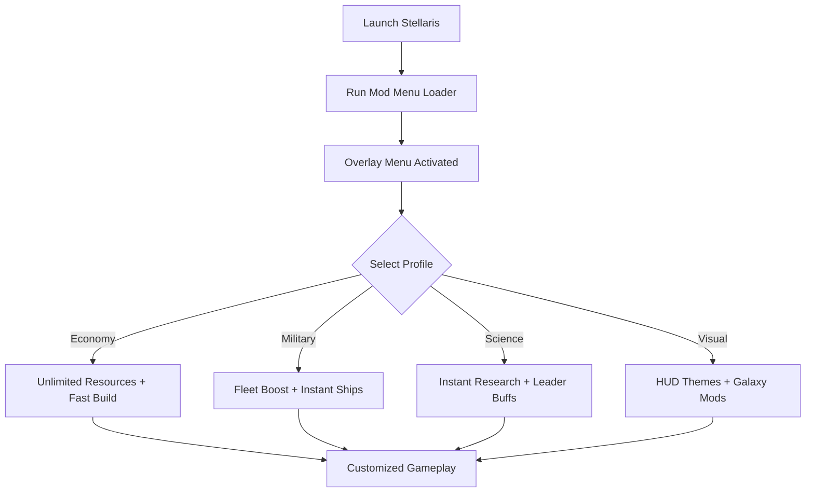

# Stellaris Mod Menu 🌌

**Stellaris** is one of the most expansive grand strategy games ever created, offering infinite replayability. But what if you could push customization further? The **Stellaris Mod Menu** provides an **in-game overlay** where you can toggle **resources, fleet boosts, research options, and visual mods** on the fly—no config editing required.

---

## 🌐 Overview

The Mod Menu functions as a **real-time overlay UI**, designed to give players complete control over their empire. From instant fleet deployment to unlimited resources, everything can be activated instantly with a hotkey or menu toggle. Profiles allow you to save presets for economic dominance, scientific supremacy, or military conquest.

---

## 🔑 Features

* 🖥 **Overlay Interface** – Enable mods without leaving the game.
* 💰 **Resource Mods** – Infinite energy, minerals, alloys, and influence.
* ⚡ **Research Tweaks** – Instant tech unlocks or accelerated science.
* 🛰 **Fleet Control** – Instant ship builds, morale boosts, and upkeep reduction.
* 👑 **Leader Options** – Max level, immortality, or custom traits.
* 🎨 **Visual Mods** – Adjust galaxy colors, HUD themes, and overlays.
* 🗂 **Profile Loader** – Save economy, science, or military-focused builds.
* ⌨️ **Hotkey Switching** – Toggle functions instantly.
* 🔒 **Lightweight Loader** – Runs with minimal system impact on Windows.

---

[](#)
[](#)
[](#)
[](#)

---

## 🖥 Compatibility

| Platform       | Status        | Notes                         |
| -------------- | ------------- | ----------------------------- |
| Windows 10     | ✅ Supported   | Stable builds                 |
| Windows 11     | ✅ Optimized   | Smoothest overlay performance |
| Linux (Proton) | ⚠️ Partial    | Limited stability             |
| macOS          | ❌ Unsupported | VM-only workaround            |

[!NOTE]
The mod menu is optimized for **Windows PC builds of Stellaris**.

---

## ⚙️ Setup Guide

1. Download the **Stellaris Mod Menu** package.

2. Extract files into the game’s installation directory.

3. Launch Stellaris.

4. Run the loader with administrator rights:

   ```bash
   stellaris_modmenu.exe -game stellaris.exe -overlay on
   ```

5. Open the menu in-game with `F4`.

6. Adjust cheats or mods directly or via `modmenu.ini`:

   ```ini
   [Resources]
   Energy=Unlimited
   Minerals=Unlimited
   Alloys=50000
   Influence=9999

   [Research]
   Instant=True
   TechUnlockAll=False

   [Fleet]
   InstantBuild=True
   MoraleBoost=True
   UpkeepReduction=True

   [Leaders]
   MaxLevel=True
   Immortal=True

   [Visuals]
   HUDTheme=Dark
   GalaxyColors=Enhanced
   ```

[!IMPORTANT]
Back up saves before using experimental mods to avoid corruption.

---

## 📊 Menu Workflow



---

## 🎚 Example Configurations

**Economic Supremacy Profile:**

```ini
Energy=Unlimited
Minerals=Unlimited
Alloys=99999
InstantBuild=True
```

**Military Domination Profile:**

```ini
InstantBuild=True
FleetPower=Max
UpkeepReduction=True
```

**Scientific Supremacy Profile:**

```ini
InstantResearch=True
ImmortalLeaders=True
TechUnlockAll=True
```

**Visual Overhaul Profile:**

```ini
HUDTheme=Neon
GalaxyColors=Vibrant
```

[!WARNING]
Overlapping mods may create unstable saves—test one at a time before combining.

---

## ❓ FAQ

**Q: Does the mod menu work in Ironman mode?**
A: No, cheats disable Ironman achievements.

**Q: Can I toggle mods mid-session?**
A: Yes, everything is real-time via overlay.

**Q: Does it affect FPS or performance?**
A: No, it’s lightweight (<3% system usage).

**Q: Do menu updates follow Stellaris patches?**
A: Yes, builds are released after major updates.

**Q: Can I restore default gameplay?**
A: Yes, disable the menu or reset configs.

---

## 🚀 Final Thoughts

The **Stellaris Mod Menu** brings **resources, research, fleet control, and visuals** together in one simple UI. Whether you’re experimenting with new builds, testing endgame scenarios, or customizing the galaxy’s look, this menu lets you take control of your Stellaris experience.

[](#)
[](#)
[](#)

---
